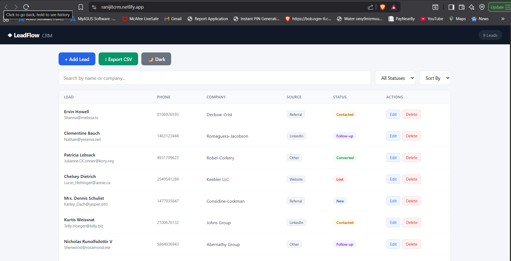
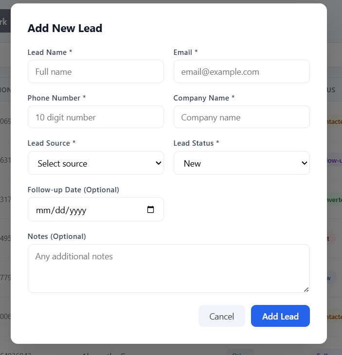
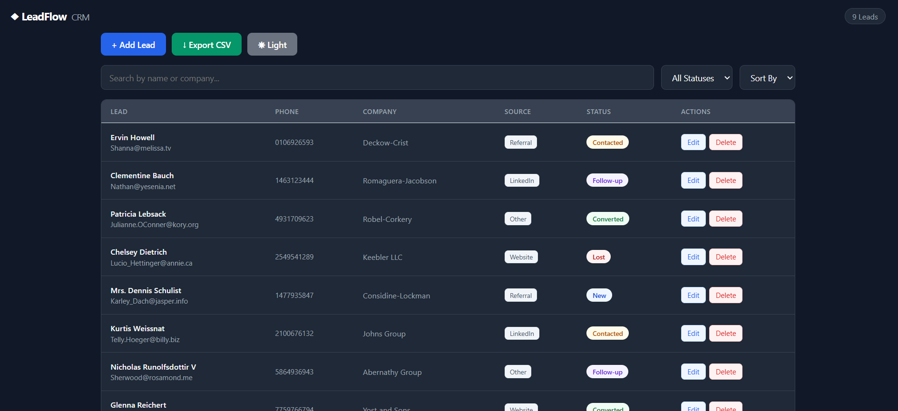

# Mini CRM System

A Mini CRM (Customer Relationship Management) application built with React to manage customer leads efficiently.

🔗 **Live Demo:** [https://ranijitcrm.netlify.app/](https://ranijitcrm.netlify.app/)

---

## Objective

This project simulates a real-world CRM used by sales or operations teams to manage customer leads. Built as a frontend assignment to evaluate understanding of React concepts and frontend development fundamentals.

---

## Features

### Core Features
- Fetch initial lead data from public API (JSONPlaceholder)
- Add new leads with form validation
- Edit existing lead details
- Delete leads with confirmation dialog
- Search leads by name or company
- Filter leads by status
- Data persists after page refresh using localStorage
- Responsive design for mobile and desktop

### Bonus Features
- Sort leads by status or date
- Dark mode toggle
- Export leads to CSV file
- Follow-up reminder date field

---

## Tech Stack

- HTML5
- CSS3
- JavaScript (ES6+)
- React (Functional Components only)
- Axios (API calls)
- Git & GitHub

---

## React Hooks Used

- `useState` — manages all application state
- `useEffect` — fetches API data on first load and syncs localStorage
- `useMemo` — optimizes search and filter operations

---

## API Used

- **Endpoint:** https://jsonplaceholder.typicode.com/users
- **Purpose:** READ-ONLY initial data fetch
- **Note:** All CRUD operations are performed on local state and localStorage only

---


## Setup Instructions

1. Clone the repository

```bash
git clone https://github.com/Ranjit2000/mini-crm-react.git
```

2. Navigate into the project

```bash
cd mini-crm-react
```

3. Install dependencies

```bash
npm install
```

4. Run the development server

```bash
npm run dev
```

5. Open in browser

```bash
http://localhost:5173
```

---

## How It Works

- On first load the app fetches 10 users from JSONPlaceholder API and maps them to lead format
- Data is saved to localStorage after first fetch so API is never called again
- All add, edit and delete operations update React state and localStorage
- Search and filter use useMemo so they only recompute when data actually changes
- Dark mode toggles a CSS class on the root container
- Export CSV downloads all current leads as a .csv file

---


## Screenshots

### Dashboard


### Add Lead Form


### Dark Mode


---

## Author

**Ranjit**
- GitHub: [@Ranjit2000](https://github.com/Ranjit2000)
- Live Project: [https://ranijitcrm.netlify.app/](https://ranijitcrm.netlify.app/)
